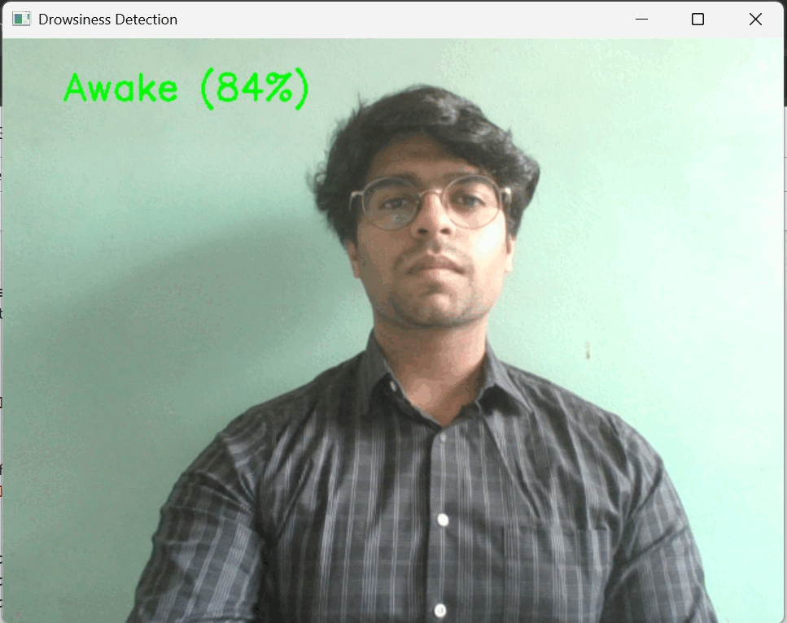

# Real-Time Driver Drowsiness Detection



This project is a real-time computer vision system designed to enhance road safety by detecting driver drowsiness from a live webcam feed and issuing an alert. The system is built using a hybrid deep learning architecture to ensure high accuracy and real-time performance.

---

### 📖 Published Research

This project forms the basis of my research paper, which was published in a UGC CARE indexed journal.

-   **Title:** [Deep Learning for Driver Drowsiness Detection: A Comprehensive Review](https://www.isteonline.in/Viewtopics.aspx?MenuId=2025_1505)
-   **Journal:** The Indian Journal of Technical Education, Volume 48 (Special Issue No 1), pp. 83-89
-   **Authors:** Parishwad, A., Rathod, D., Borude, S., & Deore, S.

---

### 🚀 Key Features

-   **High Accuracy:** The model achieves **95.4% accuracy** on the NTHU Driver Drowsiness Detection Dataset.
-   **Real-Time Performance:** Optimized to run at **18-22 FPS**, making it suitable for live in-vehicle deployment.
-   **Hybrid Deep Learning Model:** It uses a **MobileNetV2 CNN** for efficient spatial feature extraction from facial landmarks, combined with a **GRU (Gated Recurrent Unit)** to analyze the temporal sequence of frames.
-   **Robustness:** Implements temporal smoothing across video frames to increase prediction stability and reduce false positives caused by quick glances or blinks.

---

### 🛠️ Tech Stack

-   **Language:** Python
-   **Libraries:** TensorFlow, Keras, OpenCV, Pandas, NumPy

---

### 🔧 Setup and Usage

To get this project up and running on your local machine, follow these steps.

**1. Prerequisites**
-   Python 3.7+
-   A webcam

**2. Clone the Repository**
```bash
git clone [https://github.com/AryanParishwad/Driver-Drowsiness-Detection.git](https://github.com/AryanParishwad/Driver-Drowsiness-Detection.git)
cd Driver-Drowsiness-Detection
```

**3.Install Dependencies**
This project uses several Python libraries. You can install them using pip and the requirements.txt file.

```bash
pip install -r requirements.txt
```

-    (Note: You can create the requirements.txt file by running python -m pip freeze > requirements.txt in your project's terminal.)

**4. Download the Dataset**
The NTHU dataset used for training is too large to be included in this repository. Please download it from its official source and place it in the project directory as instructed by the code.

**5. Run the Application**
Execute the main Python script to start the real-time detection from your webcam.

Bash
```bash
python main.py
```

**📜 License**
This project is licensed under the MIT License. See the LICENSE file for details.
